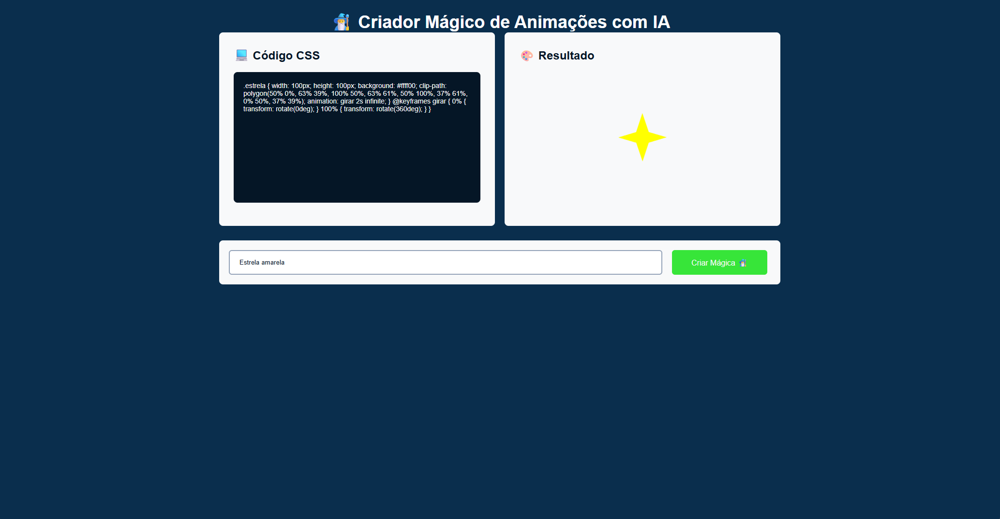

# 🧙‍♂️ Criador Mágico de Animações com IA

Um projeto front-end simples e divertido que utiliza inteligência artificial para **gerar animações CSS mágicas** a partir de descrições de texto. Basta digitar, clicar no botão e ver a mágica acontecer!



## ✨ Funcionalidades

- 📝 Entrada de texto para descrever uma animação desejada.
- ⚙️ Geração automática de código CSS com IA via webhook.
- 🎨 Exibição do código gerado.
- 🚀 Visualização ao vivo da animação.

## 📂 Estrutura do Projeto
📁 raiz

├── index.html # Estrutura principal da página

├── styles.css # Estilos e layout do projeto

├── script.js # Lógica para integração com IA via webhook

└── preview.png # Imagem de demonstração do projeto


## 💻 Tecnologias Utilizadas

- HTML5
- CSS3
- JavaScript
- API externa via Webhook (para geração de CSS com IA)

## 🔧 Como Usar

1. Clone o repositório:

```bash
git clone https://github.com/seu-usuario/criador-magico-animacoes.git
cd criador-magico-animacoes
